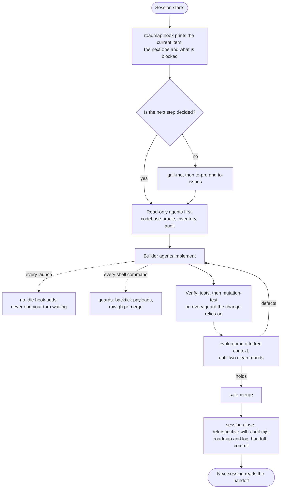

# pau-skills


The Claude Code skills, hooks and scripts I use every day, packaged as a plugin marketplace. I am Alvaro "Pau" Reis,
an AI engineer. I build products with agents doing most of the implementation, and these tools are what keeps that
work honest from one session to the next.

They are for people who already use Claude Code on real projects and have noticed the same things I have: agents
report success when a file came out wrong, rules written in `CLAUDE.md` get broken anyway, and a session that ends
without a handoff costs the next one an hour.

## The idea

**A written rule that gets broken three times becomes a script, a hook or a gate.**

Most of what is here started as a sentence in a rules file. Each one was broken often enough, while it was already
written down, that I stopped rewriting the sentence and wrote code instead: a PreToolUse hook that blocks a shell
pattern, a harness that asserts the steps I kept getting wrong, a script that measures whether a new rule is just an
old one restated. The rules that are still sentences are in [docs/RULES.md](docs/RULES.md), and each one that has a
mechanism points to it.

## Install

Add the marketplace once, then install the plugins you want:

```bash
claude plugin marketplace add paureis/pau-skills
claude plugin install session-discipline@pau-skills
claude plugin install verification@pau-skills
claude plugin install agent-orchestration@pau-skills
claude plugin install guards@pau-skills
claude plugin install planning@pau-skills
```

Inside a session, `/plugin marketplace add paureis/pau-skills` and `/plugin install <plugin>@pau-skills` do the same.
Plugin skills are namespaced: `retrospective` from `session-discipline` runs as `/session-discipline:retrospective`.

The scripts need Node.js 20 or later and no packages. `mutate.sh` needs bash (Git Bash on Windows). The hooks are
active as soon as their plugin is enabled; to turn one off, disable its plugin.

## What is in it

| Plugin | Piece | Kind | What it does | Origin |
|---|---|---|---|---|
| session-discipline | `retrospective` | skill + script | Turns a session's corrections into rule, memory or skill edits, gated by `audit.mjs` so the rule stores do not grow by restating themselves; `--stale` finds rules that cite files that are gone | Original |
| session-discipline | `session-close` | skill | Closes a session in a fixed order: clean tree, retrospective, roadmap and log, handoff, commit and push | Original |
| session-discipline | `handoff` | skill | Writes a handoff the next session can resume from, after a retrospective gate | Original |
| session-discipline | roadmap | SessionStart hook | Prints the current, next and blocked roadmap items and open questions at session start | Original |
| verification | `mutation-test` | skill + script | `mutate.sh`: one hand mutation with its three assertions checked by script (applied by content, behaviour changed, restore verified); prints the diff on SURVIVED | Original |
| verification | `evaluator` | skill (forked context) | A hostile evaluator that has not seen how the code was built grades each contract assertion with reproducible evidence | Original |
| verification | `tdd` | skill | Red-green-refactor in vertical slices, with mocking and refactoring rules | Adapted |
| agent-orchestration | no-idle | PreToolUse + SubagentStart hook | Appends "never end your turn waiting" to every agent launch | Original |
| agent-orchestration | `methodology` | skill + documents | An operating method in which no agent certifies its own work: contracts, evidence standard, evaluator, convergence, two-file state, with templates | Original |
| agent-orchestration | `codebase-oracle` | skill | Answers questions about a codebase from evidence in it only; never guesses | Original |
| guards | inline-backtick | PreToolUse hook | Blocks `node -e`, `python -c` and similar when a backtick in the payload would be executed by bash | Original |
| guards | merge guard | PreToolUse hook | Denies a raw `gh pr merge`, and `gh pr close` with branch deletion, which close stacked PRs | Original |
| guards | `safe-merge` | skill + script | Merges a PR pinned to its head commit and deletes the branch only if no open PR is based on it | Original |
| guards | `dependency-security-audit` | skill | A ranked, actionable npm vulnerability and supply-chain audit, not an `npm audit` dump | Original |
| planning | `grill-me` | skill | Interviews you one question at a time until every branch of a plan is decided | Adapted |
| planning | `to-prd` | skill | Synthesizes the conversation into a PRD without re-interviewing | Adapted |
| planning | `to-issues` | skill | Splits a plan into vertical-slice issues for any tracker | Adapted |
| planning | `improve-codebase-architecture` | skill | Finds refactors that turn shallow modules into deep ones | Adapted |

"Adapted" means derived from [mattpocock/skills](https://github.com/mattpocock/skills). [docs/ORIGINS.md](docs/ORIGINS.md)
has, for every piece, the problem that led to it and, for each adapted skill, the upstream version it was compared
against and what this version changes, taken from a diff.

Configuration, for the pieces that have any: [session-discipline](plugins/session-discipline/README.md) (roadmap file
and format), [agent-orchestration](plugins/agent-orchestration/README.md) (rule text),
[guards](plugins/guards/README.md) (trunk, promotion pairs, protected branches).

### I also use, unmodified

My copies of these differ from upstream only by being shorter, so I do not republish them. Use the originals:

- [grill-with-docs](https://github.com/mattpocock/skills/tree/main/skills/engineering/grill-with-docs) by Matt Pocock
- [prototype](https://github.com/mattpocock/skills/tree/main/skills/engineering/prototype) by Matt Pocock

## How the pieces fit into a session



## How I use these day to day

A session starts with the roadmap hook's summary in context, and with the handoff from the last session if there is
one. I work one roadmap item at a time. Before anything is built, read-only agents report on what already exists and
what the change will touch; the design discussion starts from their reports, not the other way round. When the plan
has open decisions, `grill-me` settles them one question at a time.

Implementation goes to subagents. The no-idle hook means I no longer have to remember to tell each one not to sit
waiting on a background task, and the guards stop the two shell mistakes I made most often. Nothing counts as done
because a builder said so: each guard gets a mutation run through `mutate.sh`, and an evaluator that has not seen the
build attacks it.

When the work is done or the context is running out, `session-close` runs the retrospective (whose audit usually tells
me the lesson is already written somewhere, and the fix is a hook rather than another sentence), updates the roadmap
and the log, writes the handoff, and commits.

## Development

```bash
npm test                  # node --test, no dependencies
npm run scrub             # fails if a file carries a private name, an account id, a machine path or untranslated text
claude plugin validate .  # the marketplace; add a plugin path to check one plugin
```

## Credits

- The planning skills and `tdd` are adapted from [mattpocock/skills](https://github.com/mattpocock/skills) by Matt
  Pocock, under the MIT License. The upstream notice is in [NOTICE](NOTICE).
- Everything else is mine, under the MIT License ([LICENSE](LICENSE)).
