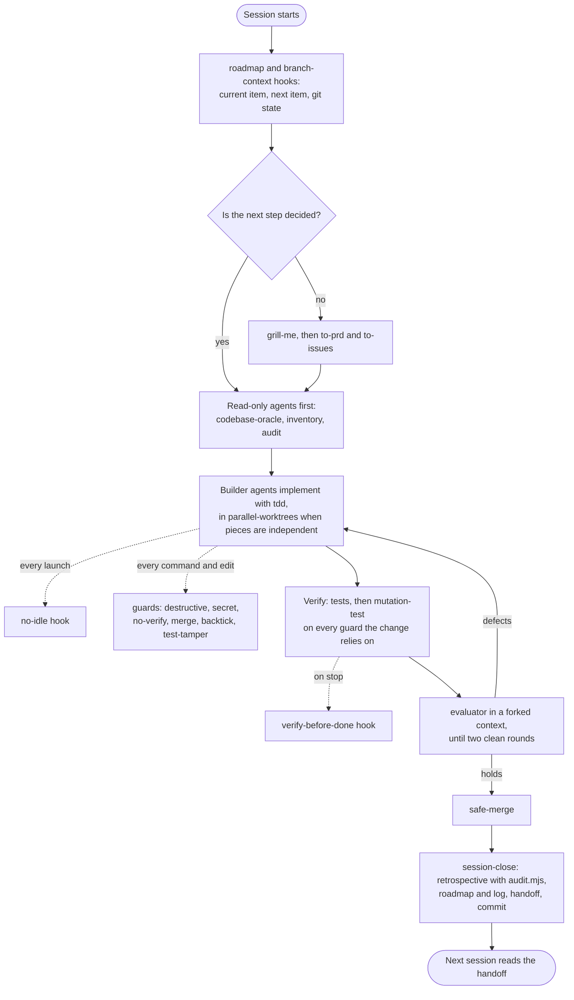

# pau-skills


The Claude Code skills, hooks and scripts I use every day, packaged as a plugin marketplace. I am Alvaro "Pau" Reis,
an AI engineer. They are for people who already use Claude Code on real projects and have noticed the same things I
have: agents report success when a file came out wrong, rules written in `CLAUDE.md` get broken anyway, and a session
that ends without a handoff costs the next one an hour.

Nothing here depends on a language or framework. The skills work in any repository, and the hooks are small Node.js
scripts with no dependencies and a test suite that proves each one can fail.

## Quick start

```bash
claude plugin marketplace add paureis/pau-skills
claude plugin install pau-skills@pau-skills
```

That installs everything. To take only part of it, install individual plugins instead (`session-discipline`,
`verification`, `agent-orchestration`, `guards`, `planning`), or copy a single skill's folder: every skill works on its
own, without the plugin or any other skill. For Codex, Cursor and other agents, the skills alone
install with `npx skills@latest add paureis/pau-skills`.

Not sure where to start? Run `/pau-skills:which-skill` and describe what you are doing.

[docs/INSTALL.md](docs/INSTALL.md) has every install, update and removal command.
[hooks/README.md](hooks/README.md) explains every hook and how to turn any of them off.

## What is where

```
skills/        every skill, one folder each, grouped by plugin
  session-discipline/   verification/   agent-orchestration/   guards/   planning/
hooks/         every hook script, grouped the same way, with the shared code in lib/
docs/          install guide, origins of each piece, the rules that are still sentences, how to add a skill
tests/         node:test suites for every script and hook (npm test)
scripts/       repository tooling: the marketplace builder, the skill scaffolder, the scrub check
.claude-plugin/marketplace.json   the plugin definitions Claude Code reads
```

## The idea

**A written rule that gets broken three times becomes a script, a hook or a gate.**

Most of what is here started as a sentence in a rules file. Each one was broken often enough, while it was already
written down, that I stopped rewriting the sentence and wrote code instead: a PreToolUse hook that blocks a shell
pattern, a harness that asserts the steps I kept getting wrong, a script that measures whether a new rule is just an
old one restated. The rules that are still sentences are in [docs/RULES.md](docs/RULES.md), and each one that has a
mechanism points to it. The `rule-to-hook` skill turns that habit into a process you can run on your own rules.

## Problems this fixes

### 1. "Done" when it is not done

The agent says the feature works. It never ran the tests, or the test it wrote cannot fail, or it made the suite
green by skipping the failing test.

- `verify-before-done` (hook) sends the agent back once if it changed code and ran no test, build or check afterwards.
- `test-tamper-guard` (hook) asks you before a test is skipped, focused or stripped of assertions.
- `tdd` builds one behaviour at a time, test first.
- `mutation-test` breaks the code on purpose to prove a test catches it.
- `evaluator` has a fresh agent, which did not build the change, grade it against its acceptance criteria.

### 2. Rules that are written down and still broken

`CLAUDE.md` grows by restating itself, and the rules that matter most are the ones broken under pressure.

- `rule-to-hook` turns a rule that keeps being broken into a hook with tests, step by step.
- `retrospective` turns a session's corrections into rule, memory or skill edits, gated by a script so nothing gets
  written twice.
- `claude-md-audit` finds the size, duplicates, contradictions, stale references and vague rules in your instruction
  files.

### 3. One command that cannot be undone

An agent that wants a clean slate reaches for `rm -rf`, `git reset --hard` or a force push, and the clean slate is
your work. An agent that wants a green commit reaches for `--no-verify`. An agent that wants a working demo pastes the
API key into the source.

- `destructive-guard` (hook) blocks deleting outside the project, force pushes to protected branches, discarding
  uncommitted work, `DROP DATABASE`, `terraform destroy` and similar.
- `secret-guard` (hook) blocks credentials being written into files.
- `no-verify-guard` (hook) blocks skipping git hooks and commit signing.
- `merge-guard` (hook) and `safe-merge` merge pull requests without closing the ones stacked on them.
- `inline-backtick-guard` (hook) blocks inline interpreter payloads that bash would silently rewrite.

### 4. Every session starts from zero

The new session does not know what the last one finished, which branch it is on, or what the user said before the
context was compacted.

- `roadmap` and `branch-context` (hooks) open every session with the current roadmap item and the git state.
- `compact-snapshot` (hook) saves your last messages, edited files and todo list before a compaction and hands them
  back after.
- `session-close` ends a session in a fixed order: retrospective, roadmap and log, handoff, commit.
- `handoff` writes a handoff the next session can resume from.

### 5. Building before the plan is decided

- `grill-me` interviews you one question at a time until every branch of the plan is decided.
- `to-prd` and `to-issues` turn the decided plan into a spec and vertical-slice issues.
- `codebase-oracle` answers questions about the code from evidence in the code, and says when it cannot.
- `improve-codebase-architecture` finds refactors that make modules deeper and easier to test.

### 6. Several agents in one repository

- `parallel-worktrees` splits work into independent pieces, one git worktree and branch per agent, then integrates
  them one at a time.
- `methodology` is an operating method where no agent certifies its own work.
- `no-idle` (hook) stops subagents from ending their turn waiting for something that will never wake them.

### 7. The careful work nobody wants to do

- `dependency-upgrade` plans and applies upgrades in any ecosystem, one major version at a time, on a green baseline.
- `dependency-security-audit` gives a ranked vulnerability, reachability and supply-chain report for any ecosystem
  and for container images.
- `migration-review` checks a database migration for locks, downtime, data loss and a way back before it runs.
- `flaky-test-hunt` measures how often a test fails, finds the actual cause, and proves the fix.
- `ci-cost-and-cadence` decides how much CI to run and when, from measurements.

### 8. Starting with Claude Code for the first time

Someone who knows Claude from the browser opens Claude Code in their project and does not know what to ask, what it
will change, or how to make it remember how they like to work.

- `project-setup` reads the project, asks about ten short questions one at a time (Learn, Build or Mix; how much
  freedom Claude gets; what "done" means), shows the CLAUDE.md it wants to write, and writes nothing without a yes.
  It ends with a cheat sheet for the desktop app, terminal or editor, and a first small task. It works on its own,
  without the rest of this marketplace.

## Reference

Every skill is a folder in [`skills/`](skills), grouped by plugin, and every hook is a script in [`hooks/`](hooks).
Each name below links to the file itself. A skill runs as `/<plugin>:<skill>`, or `/pau-skills:<skill>` from the
bundle. "Adapted" marks the skills
derived from [mattpocock/skills](https://github.com/mattpocock/skills); everything else is original.

### session-discipline

- **[which-skill](skills/session-discipline/which-skill/SKILL.md)**: Recommends the skill or sequence of skills that fits your situation.
- **[retrospective](skills/session-discipline/retrospective/SKILL.md)**: Turns a session's corrections into rule, memory or skill edits, gated by `audit.mjs`; `--stale`
  finds rules that cite files that are gone.
- **[session-close](skills/session-discipline/session-close/SKILL.md)**: Closes a session in a fixed order: clean tree, retrospective, roadmap and log, handoff, commit
  and push.
- **[handoff](skills/session-discipline/handoff/SKILL.md)**: Writes a handoff the next session can resume from, after a retrospective gate.
- **[claude-md-audit](skills/session-discipline/claude-md-audit/SKILL.md)**: Audits CLAUDE.md, AGENTS.md and similar files, with `scan.mjs` for size, duplicates, stale
  references and secrets, and proposes edits for approval.
- **[project-setup](skills/session-discipline/project-setup/SKILL.md)**: Interviews you about how you want to work, then writes the project CLAUDE.md and,
  with a separate yes, your personal preferences. Written for people new to Claude Code.
- Hooks: [`roadmap`](hooks/session-discipline/roadmap.mjs), [`branch-context`](hooks/session-discipline/branch-context.mjs), [`compact-snapshot`](hooks/session-discipline/compact-snapshot.mjs).

### verification

- **[tdd](skills/verification/tdd/SKILL.md)** (adapted): Red-green-refactor in vertical slices, with mocking and refactoring rules.
- **[mutation-test](skills/verification/mutation-test/SKILL.md)**: `mutate.sh` applies one mutation and checks by script that it applied, changed behaviour, and
  was restored.
- **[evaluator](skills/verification/evaluator/SKILL.md)**: A hostile evaluator in a forked context grades each contract assertion with reproducible evidence.
- **[flaky-test-hunt](skills/verification/flaky-test-hunt/SKILL.md)**: Reproduces an intermittent failure with `repeat.mjs`, classifies the cause, and proves the
  fix with a measured failure rate.
- **[migration-review](skills/verification/migration-review/SKILL.md)**: Reviews a schema or data migration for locks, compatibility with running code, data safety
  and reversibility, for any migration tool.
- **[ci-cost-and-cadence](skills/verification/ci-cost-and-cadence/SKILL.md)**: Measures where CI minutes go, compares five options with numbers, and builds the chosen
  one.
- Hooks: [`test-tamper-guard`](hooks/verification/test-tamper-guard.mjs), [`verify-before-done`](hooks/verification/verify-before-done.mjs).

### agent-orchestration

- **[methodology](skills/agent-orchestration/methodology/SKILL.md)**: Contracts, an evidence standard, an evaluator, convergence and two-file state, with templates.
- **[codebase-oracle](skills/agent-orchestration/codebase-oracle/SKILL.md)**: Answers questions about a codebase from evidence in it only; never guesses.
- **[parallel-worktrees](skills/agent-orchestration/parallel-worktrees/SKILL.md)**: Runs independent pieces of work in separate git worktrees, with `worktrees.mjs` to check a
  plan for overlapping files and report every worktree's state.
- Hook: [`no-idle`](hooks/agent-orchestration/no-idle.mjs).

### guards

- **[rule-to-hook](skills/guards/rule-to-hook/SKILL.md)**: Turns a rule that keeps being broken into a tested hook, with templates in JavaScript and Python.
- **[safe-merge](skills/guards/safe-merge/SKILL.md)**: Merges a PR pinned to its head commit and deletes the branch only if no open PR is based on it.
- **[dependency-upgrade](skills/guards/dependency-upgrade/SKILL.md)**: Plans and applies dependency and toolchain upgrades in any ecosystem, step by step.
- **[dependency-security-audit](skills/guards/dependency-security-audit/SKILL.md)**: A ranked vulnerability, reachability and supply-chain audit for any ecosystem and
  container image, built on native audit tools and OSV-based scanners, not a raw scanner dump.
- Hooks: [`secret-guard`](hooks/guards/secret-guard.mjs), [`destructive-guard`](hooks/guards/destructive-guard.mjs), [`no-verify-guard`](hooks/guards/no-verify-guard.mjs), [`merge-guard`](hooks/guards/merge-guard.mjs), [`inline-backtick-guard`](hooks/guards/block-inline-backtick-payload.mjs).

### planning

- **[grill-me](skills/planning/grill-me/SKILL.md)** (adapted): Interviews you one question at a time until every branch of a plan is decided.
- **[to-prd](skills/planning/to-prd/SKILL.md)** (adapted): Synthesizes the conversation into a PRD without re-interviewing.
- **[to-issues](skills/planning/to-issues/SKILL.md)** (adapted): Splits a plan into vertical-slice issues for any tracker.
- **[improve-codebase-architecture](skills/planning/improve-codebase-architecture/SKILL.md)** (adapted): Finds refactors that turn shallow modules into deep ones.

[docs/ORIGINS.md](docs/ORIGINS.md) records, for every piece, the problem that led to it and, for each adapted skill,
the upstream version it was compared against and what this version changes, taken from a diff.

### I also use, unmodified

My copies of these differ from upstream only by being shorter, so I do not republish them. Use the originals:

- [grill-with-docs](https://github.com/mattpocock/skills/tree/main/skills/engineering/grill-with-docs) by Matt Pocock
- [prototype](https://github.com/mattpocock/skills/tree/main/skills/engineering/prototype) by Matt Pocock

## How the pieces fit into a session



## How I use these day to day

A session starts with the roadmap and git summary in context, and with the handoff from the last session if there is
one. I work one roadmap item at a time. Before anything is built, read-only agents report on what already exists and
what the change will touch; the design discussion starts from their reports, not the other way round. When the plan
has open decisions, `grill-me` settles them one question at a time.

Implementation goes to subagents. The no-idle hook means I no longer have to remember to tell each one not to sit
waiting on a background task, and the guards stop the shell mistakes I made most often. Nothing counts as done
because a builder said so: each guard gets a mutation run through `mutate.sh`, and an evaluator that has not seen the
build attacks it.

When the work is done or the context is running out, `session-close` runs the retrospective (whose audit usually tells
me the lesson is already written somewhere, and the fix is a hook rather than another sentence), updates the roadmap
and the log, writes the handoff, and commits.

## Development

```bash
npm test                          # node --test, no dependencies
npm run scrub                     # fails on private names, account ids, machine paths or untranslated text
node scripts/build-marketplace.mjs  # regenerate marketplace.json after changing a hooks.json or a plugin folder
claude plugin validate . --strict # the marketplace; add a plugin path to check one plugin
```

To bring a new skill into the repository, start with `node scripts/new-skill.mjs <plugin> <skill-name>` and follow
[docs/ADDING-A-SKILL.md](docs/ADDING-A-SKILL.md).

## Credits

- The planning skills and `tdd` are adapted from [mattpocock/skills](https://github.com/mattpocock/skills) by Matt
  Pocock, under the MIT License. The upstream notice is in [NOTICE](NOTICE). The layout of this README, organised
  around the problems each piece fixes, also follows his.
- Everything else is mine, under the MIT License ([LICENSE](LICENSE)).
